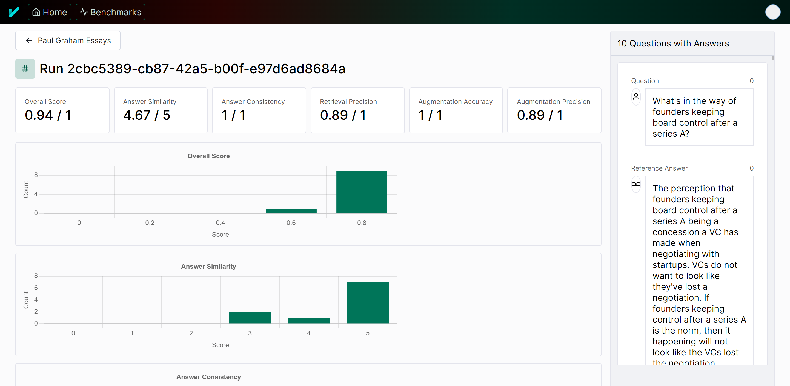

# Tonic Validate Evaluation Framework

Tonic Validate is a framework for the evaluation of LLM outputs, such as Retrieval Augmented Generation (RAG) pipelines. Validate makes it easy to evaluate, track, and monitor your LLM and RAG applications.  Install via pip and quickly embed Validate into your existing code.  More detailed documentation is available [here](https://docs.tonic.ai/validate/). But the below quickstart guide is likely all you need to get started.

## Quickstart

1. Install Tonic Validate
   ```
   pip install tonic-validate
   ```
   
  
2. Use the following code snippet to get started.

    ```python
    from tonic_validate import ValidateScorer, Benchmark
    import os

    os.environ["OPENAI_API_KEY"] = "your-openai-key"

    # Function to simulate getting a response and context from your LLM
    # Replace this with your actual function call
    def get_llm_response(question):
        return {
            "llm_answer": "Paris",
            "llm_context_list": ["Paris is the capital of France."]
        }

    benchmark = Benchmark(questions=["What is the capital of France?"], answers=["Paris"])
    # Score the responses for each question and answer pair
    scorer = ValidateScorer()
    run = scorer.score(benchmark, get_llm_response)
    ```

This code snippet, creates a benchmark with one question and reference answer and then scores the answer.  Providing a reference answer is not required for most metrics (see below Metrics table).

## CI/CD

Many users find value in running evaluations during the code review/pull request process.  You can create your own automation here using the snippet above and knowledge found in our documentation and this readme OR you can take advantage of our absolutely free Github Action in the Github Marketplace.  The listing is [here](https://github.com/marketplace/actions/tonic-validate-for-prs).  It's easy to setup but if you have any questions, just create an issue in the corresponding repository.

## Tonic Validate Metrics
Metrics are used to score your LLM's performance.  Validate ships with 6 metrics which are applicable to most RAG systems.  You can create your own metrics as well by providing your own implementation of [metric.py](https://github.com/TonicAI/tonic_validate/blob/main/tonic_validate/metrics/metric.py).  To compute a metric, you must provide it data from your RAG application.  The table below describes the available default metrics.

| Metric Name | Inputs | Score Range | What does it measure? |
|-------------------------------|-----------------------------------------------------|--------|-------------------------------------------------------------------------------------|
| **Answer similarity score**   | `Question`<br/>`Reference answer`<br/>`LLM answer`  | 0 to 5 | How well the reference answer matches the LLM answer.                               |
| **Retrieval precision**       | `Question`<br/>`Retrieved Context`                  | 0 to 1 | Whether the context retrieved is relevant to answer the given question.             |
| **Augmentation precision**    | `Question`<br/>`Retrieved Context`<br/>`LLM answer` | 0 to 1 | Whether the relevant context is in the LLM answer.                                  |
| **Augmentation accuracy**     | `Retrieved Context`<br/>`LLM answer`                | 0 to 1 | Whether all the context is in the LLM answer.                                       |
| **Answer consistency**        | `Retrieved Context`<br/>`LLM answer`                | 0 to 1 | Whether there is information in the LLM answer that does not come from the context. |
| **Answer consistency binary** | `Retrieved Context`<br/>`LLM answer`                | 0 to 1 | Whether there is information in the LLM answer that does not come from the context. |

**Note**: More details on these metrics can be found in our [documentation](https://docs.tonic.ai/validate/about-rag-metrics/tonic-validate-rag-metrics-reference).

### Metric Inputs
Metric inputs in Tonic Validate are used to provide the metrics with the information they need to calculate performance. Below, we explain each input type and how to pass them into Tonic Validate's SDK.

#### Question 
**What is it**: The question asked  
 **How to use**: You can provide the questions by passing them into the `Benchmark` via the `questions` argument.  
```python
from tonic_validate import Benchmark
benchmark = Benchmark(
    questions=["What is the capital of France?", "What is the capital of Germany?"]
)
```

#### Reference Answer 
**What is it**: A prewritten answer that serves as the ground truth for how the RAG application should answer the question.  
**How to use**: You can provide the reference answers by passing it into the `Benchmark` via the `answers` argument. Each reference answer must correspond to a given question. So if the reference answer is for the third question in the `questions` list, then the reference answer must also be the third item in the `answers` list.  The only metric that requires a reference answer is the Answer Similarity Score
```python
from tonic_validate import Benchmark
benchmark = Benchmark(
    questions=["What is the capital of France?", "What is the capital of Germany?"]
    answers=["Paris", "Berlin"]
)
```

#### LLM Answer
**What is it**: The answer the RAG application / LLM gives to the question.  
**How to use**: You can provide the LLM answer via the callback you provide to the Validate scorer. The answer is the first item in the tuple response. 
```python
# Function to simulate getting a response and context from your LLM
# Replace this with your actual function call
def get_rag_response(question):
    return {
        "llm_answer": "Paris",
        "llm_context_list": ["Paris is the capital of France."]
    }

# Score the responses
scorer = ValidateScorer()
run = scorer.score(benchmark, ask_rag)
```
If you are manually logging the answers without using the callback, then you can provide the LLM answer via `llm_answer` when creating the `LLMResponse`.  
```python
from tonic_validate import LLMResponse
# Save the responses into an array for scoring
responses = []
for item in benchmark:
    # llm_answer is the answer that LLM gives
    llm_response = LLMResponse(
        llm_answer="Paris",
        benchmark_item=item
    )
    responses.append(llm_response)

# Score the responses
scorer = ValidateScorer()
run = scorer.score_responses(responses)
```


#### Retrieved Context
**What is it**: The context that your RAG application retrieves when answering a given question. This context is what's put in the prompt by the RAG application to help the LLM answer the question.  
**How to use**: You can provide the LLM's retrieved context list via the callback you provide to the Validate scorer. The answer is the second item in the tuple response. The retrieved context is always a list
```python
# Function to simulate getting a response and context from your LLM
# Replace this with your actual function call
def get_rag_response(question):
    return {
        "llm_answer": "Paris",
        "llm_context_list": ["Paris is the capital of France."]
    }

# Score the responses
scorer = ValidateScorer()
run = scorer.score(benchmark, ask_rag)
```
If you are manually logging the answers, then you can provide the LLM context via `llm_context_list` when creating the `LLMResponse`.  
```python
from tonic_validate import LLMResponse
# Save the responses into an array for scoring
responses = []
for item in benchmark:
    # llm_answer is the answer that LLM gives
    # llm_context_list is a list of the context that the LLM used to answer the question
    llm_response = LLMResponse(
        llm_answer="Paris",
        llm_context_list=["Paris is the capital of France."],
        benchmark_item=item
    )
    responses.append(llm_response)

# Score the responses
scorer = ValidateScorer()
run = scorer.score_responses(responses)
```

### Scoring With Metrics

Most metrics are scored with the assistance of a LLM.  Validate supports OpenAI and Azure OpenAI but other LLMs can easily be integrated (just file an github issue against this repository).

#### **Important**: Setting up OpenAI Key for Scoring
In order to use OpenAI you must provide an OpenAI API Key.
```python
import os
os.environ["OPENAI_API_KEY"] = "put-your-openai-api-key-here"
```
If you already have the `OPENAI_API_KEY` set in your system's environment variables then you can skip this step. Otherwise, please set the environment variable before proceeding.

##### Using Azure
If you are using Azure, instead of setting the `OPENAI_API_KEY` environment variable, you instead need to set `AZURE_OPENAI_KEY` and `AZURE_OPENAI_ENDPOINT`. `AZURE_OPENAI_ENDPOINT` is the endpoint url for your Azure OpenAI deployment and `AZURE_OPENAI_KEY` is your API key.
```python
import os
os.environ["AZURE_OPENAI_KEY"] = "put-your-azure-openai-api-key-here"
os.environ["AZURE_OPENAI_ENDPOINT"] = "put-your-azure-endpoint-here"
```


#### Setting up the Tonic Validate Scorer
To use metrics, instantiate an instance of ValidateScorer.
```python
from tonic_validate import ValidateScorer
scorer = ValidateScorer()
```

The default model used for scoring metrics is GPT 4 Turbo. To change the OpenAI model, pass the OpenAI model name into the `model_evaluator` argument for `ValidateScorer`. You can also pass in custom metrics via an array of metrics.

```python
from tonic_validate import ValidateScorer
from tonic_validate.metrics import AnswerConsistencyMetric, AnswerSimilarityMetric

scorer = ValidateScorer([
    AnswerConsistencyMetric(),
    AugmentationAccuracyMetric()
], model_evaluator="gpt-3.5-turbo")
```

If an error occurs while scoring an item's metric, the score for that metric will be set to `None`. If you instead wish to have Tonic Validate throw an exception when there's an error scoring, then set `fail_on_error` to `True` in the constructor

```python
scorer = ValidateScorer(fail_on_error=True)
```

#### **Important**: Using the scorer on Azure
If you are using Azure, you MUST set the `model_evaluator` argument to your deployment name like so
```python
scorer = ValidateScorer(model_evaluator="your-deployment-name")
```

#### Running the Scorer
After you instantiate the `ValidateScorer` with your desired metrics, you can then score the metrics using the callback you defined earlier.

```python
from tonic_validate import ValidateScorer, ValidateApi

# Function to simulate getting a response and context from your LLM
# Replace this with your actual function call
def get_rag_response(question):
    return {
        "llm_answer": "Paris",
        "llm_context_list": ["Paris is the capital of France."]
    }

# Score the responses
scorer = ValidateScorer()
run = scorer.score(benchmark, ask_rag)
```

##### Running the Scorer with manual logging
If you don't want to use the callback, you can instead log your answers manually by iterating over the benchmark and then score the answers.
```python
from tonic_validate import ValidateScorer, LLMResponse

# Function to simulate getting a response and context from your LLM
# Replace this with your actual function call
def get_rag_response(question):
    return {
        "llm_answer": "Paris",
        "llm_context_list": ["Paris is the capital of France."]
    }

# Save the responses into an array for scoring
responses = []
for item in benchmark:
    rag_response = get_rag_response(item.question)
    llm_response = LLMResponse(
        llm_answer=rag_response["llm_answer"],
        llm_context_list=rag_response["llm_context_list"],
        benchmark_item=item
    )
    responses.append(llm_response)

# Score the responses
scorer = ValidateScorer()
run = scorer.score_responses(responses)
```

### Viewing the Results
There are two ways to view the results of a run.

#### Option 1: Print Out the Results
You can manually print out the results via python like so
```python
print("Overall Scores")
print(run.overall_scores)
print("------")
for item in run.run_data:
    print("Question: ", item.reference_question)
    print("Answer: ", item.reference_answer)
    print("LLM Answer: ", item.llm_answer)
    print("LLM Context: ", item.llm_context)
    print("Scores: ", item.scores)
    print("------")
```
which outputs the following
```
Overall Scores
{'answer_consistency': 1.0, 'augmentation_accuracy': 1.0}
------
Question:  What is the capital of France?
Answer:  Paris
LLM Answer:  Paris
LLM Context:  ['Paris is the capital of France.']
Scores:  {'answer_consistency': 1.0, 'augmentation_accuracy': 1.0}
------
Question:  What is the capital of Spain?
Answer:  Madrid
LLM Answer:  Paris
LLM Context:  ['Paris is the capital of France.']
Scores:  {'answer_consistency': 1.0, 'augmentation_accuracy': 1.0}
------
```
### Use the Tonic Validate UI (Recommended, Free to Use)
You can easily view your run results by uploading them to our **free to use UI**. The main advantage of this method is the Tonic Validate UI provides graphing for your results along with additional visualization features. To sign up for the UI, go to [here](https://validate.tonic.ai/).

Once you sign up for the UI, you will go through an onboarding to create an API Key and Project.

<picture>
  
</picture>

Copy both the API Key and Project ID from the onboarding and insert it into the following code
```
from tonic_validate import ValidateApi
validate_api = ValidateApi("your-api-key")
validate_api.upload_run("your-project-id", run)
```
This will upload your run to the Tonic Validate UI where you can view the results. On the home page (as seen below) you can view the change in scores across runs over time.  
<picture>
  
</picture>

You can also view the results of an individual run in the UI as well.  
<picture>
  
</picture>

### Telemetry
Tonic Validate collects minimal telemetry to help us figure out what users want and how they're using the product. We do not use any existing telemetry framework and instead created our own privacy focused setup. Only the following information is tracked

* What metrics were used for a run
* Number of questions in a run
* Number of questions in a benchmark

We do **NOT** track things such as the contents of the questions / answers, your scores, or any other sensitive information. For detecting CI/CD, we only check for common environment variables in different CI/CD environments. We do not log the values of these environment variables.

We also generate a random UUID to help us figure out how many users are using the product. This UUID is linked to your Validate account only to help track who is using the SDK and UI at once and to get user counts. If you want to see how we implemented telemetry, you can do so in the `tonic_validate/utils/telemetry.py` file

If you wish to opt out of telemetry, you only need to set the `TONIC_VALIDATE_DO_NOT_TRACK` environment variable to `True`.

## FAQ

#### What models can I use an LLM evaluator?

We currently allow the family of chat completion models from Open AI.

This restriction makes it easy to follow the logic for the definition of the metrics in this package. It also ensures that this package does not depend on langchain, which also makes the logic of the package easier to follow.

We'd like to add more models as choices for the LLM evaluator without adding to the complexity of the package too much.

The default model used for scoring metrics is GPT 4 Turbo. To change the OpenAI model, pass the OpenAI model name into the `model` argument for `ValidateScorer`

```python
scorer = ValidateScorer([
    AnswerConsistencyMetric(),
    AugmentationAccuracyMetric()
], model_evaluator="gpt-3.5-turbo")
```
