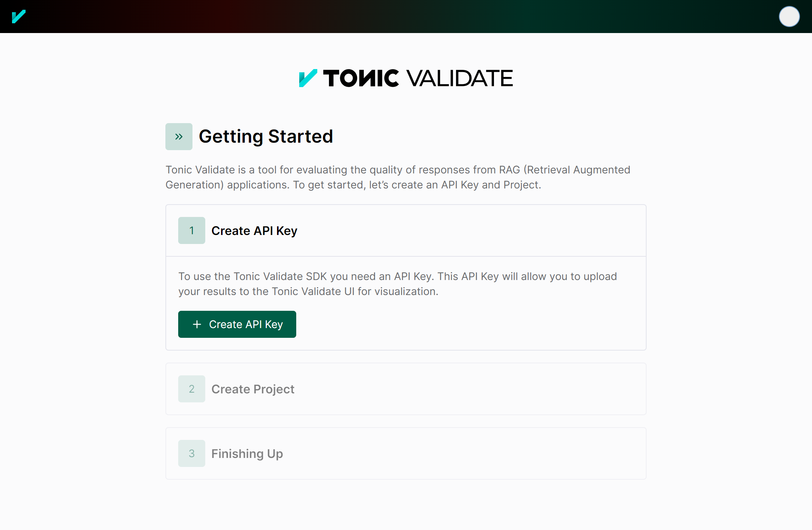

<picture>
  <source media="(prefers-color-scheme: light)" srcset="./readme_images/TonicValidate-Horizontal-Dark-Icon.svg">
  <source media="(prefers-color-scheme: dark)" srcset="./readme_images/TonicValidate-Horizontal-White-Icon.svg">
  
</picture>

Tonic Validate is a platform for Retrieval Augmented Generation (RAG) development and experiment tracking. This repository, `tonic_validate` (formerly `tvalmetrics`) is the SDK component of Tonic Validate. It contains the code for calculating RAG metrics and optionally logging them to the [Tonic Validate UI](https://www.tonic.ai/validate).

*  [Documentation](https://docs.tonic.ai/validate/)

## Check Out Our UI to Visualize Your Results
In addition to the SDK, we also have a **free to use UI**. Using the UI isn't required to use the SDK, but it does allow you to easily visualize your results. To sign up, click [here](https://validate.tonic.ai/).  
<picture>
  
</picture>


# Quickstart

1. Install the Tonic Validate SDK by running
   ```
   pip install tonic-validate
   ```
   in your terminal.
  
2. Use the following code snippet to get started.

    ```python
    from tonic_validate import ValidateScorer, Benchmark, LLMResponse
    from tonic_validate.metrics import AnswerConsistencyMetric, AugmentationAccuracyMetric
    import os
    os.environ["OPENAI_API_KEY"] = "put-your-openai-api-key-here"

    # Create a list of questions (required) and answers (optional) for scoring the LLM's performance
    benchmark = Benchmark(
        questions=["What is the capital of France?"],
        answers=["Paris"]
    )

    # Function to simulate getting a response and context from your LLM
    # Replace this with your actual function call
    def get_llm_response(question):
        # Simulating a response from the LLM
        # In your actual implementation, this will call your LLM
        return "Paris", ["Paris is the capital of France."]  # Example response and context

    # Save the responses into an array for scoring
    responses = []
    for item in benchmark:
        # llm_answer is the answer that LLM gives
        # llm_context_list is a list of the context that the LLM used to answer the question
        llm_answer, llm_context_list = get_llm_response(item.question)
        llm_response = LLMResponse(
            llm_answer=llm_answer,
            llm_context_list=llm_context_list,
            benchmark_item=item
        )
        responses.append(llm_response)
    
    # Score the responses
    scorer = ValidateScorer([
        AnswerConsistencyMetric(),
        AugmentationAccuracyMetric()
    ])
    run = scorer.score_run(responses)
    ```

This code snippet, creates a benchmark with one question and reference answer and then scores the answer with the metrics `AnswerConsistencyMetric` and `AugmentationAccuracyMetric`.

# Tonic Validate Benchmarks

## What Are Benchmarks?
To evaluate the RAG (Retrieval Augmented Generation) system's performance, we need a dataset of questions to prompt it with. This is what Benchmarks are for. Benchmarks are a collection of questions which optionally include reference answers. When calculating the performance, Tonic Validate's SDK runs through the list of the questions in the benchmark and asks the LLM each question. Then, Tonic Validate uses the resulting answer from the LLM to figure out the RAG system's performance.

> **Note**: If you are using the `AnswerSimilarityMetric` then you also need to provide a reference answer to each question in the benchmark. The reference answer represents the ideal or correct response to the question. For example, consider the question, "What is the capital of France?" The corresponding reference answer should be "Paris." When using the `AnswerSimilarityMetric`, the actual answer provided by the LLM is compared against this reference answer to determine how close the LLM's response is to the ideal answer.

## How to Use Benchmarks

To use benchmarks, you can pass in a list of `questions` to ask the LLM (and optionally a list of reference answers via `answers`).
```python
from tonic_validate import Benchmark
# Create a list of questions (required) and answers (optional) for scoring the LLM's performance
benchmark = Benchmark(
    questions=["What is the capital of France?", "What is the capital of Germany?"]
    answers=["Paris", "Berlin"]
)
```
To ask the LLM the questions from the benchmark, you can loop over the benchmark items like so  
```python
# Function to simulate getting a response and context from your LLM
# Replace this with your actual function call
def get_llm_response(question):
    # Simulating a response from the LLM
    # In your actual implementation, this will call your LLM
    return "Paris", ["Paris is the capital of France."]  # Example response and context

for item in benchmark:
    # Ask your question here (replace with your own code)
    llm_answer = get_llm_answer(item.question)
```
To save the LLM responses when looping over the benchmark, you can pass the `llm_answer`, `llm_context_list`, and the benchmark item to `LLMResponse`.  
```python
# Function to simulate getting a response and context from your LLM
# Replace this with your actual function call
def get_llm_response(question):
    # Simulating a response from the LLM
    # In your actual implementation, this will call your LLM
    return "Paris", ["Paris is the capital of France."]  # Example response and context

# Save the responses into an array for scoring
responses = []
for item in benchmark:
    # llm_answer is the answer that LLM gives
    # llm_context_list is a list of the context that the LLM used to answer the question
    llm_answer, llm_context_list = get_llm_response(item.question)
    llm_response = LLMResponse(
        llm_answer=llm_answer,
        llm_context_list=llm_context_list,
        benchmark_item=item
    )
    responses.append(llm_response)
```

# Tonic Validate Metrics
Metrics are used to score your LLM's performance. To measure each metric, you will need to provide the required inputs for that metric. Below is a table of the different metrics and the inputs they require.

| Metric Name                                             | Inputs                                    | Formula                                                                                                       | Score Range | What does it measure?                                                               |
|---------------------------------------------------------|-------------------------------------------|---------------------------------------------------------------------------------------------------------------|-------------|-------------------------------------------------------------------------------------|
| **Answer similarity score**                             | Question + Reference answer + LLM answer  | Scored by LLM on a scale of 0 to 5                                                                            | 0 to 5      | How well the reference answer matches the LLM answer.                               |
| **Retrieval precision**                                 | Question + Retrieved context              | (Count of relevant retrieved context) / (Count of retrieved context)                                          | 0 to 1      | Whether the context retrieved is relevant to answer the given question.             |
| **Augmentation precision**                              | Question + Retrieved context + LLM answer | (Count of relevant retrieved context in LLM answer) / (Count of relevant retrieved context)                   | 0 to 1      | Whether the relevant context is in the LLM answer.                                  |
| **Augmentation accuracy**                               | Retrieved context + LLM answer            | (Count of retrieved context in LLM answer) / (Count of retrieved context)                                     | 0 to 1      | Whether all the context is in the LLM answer.                                       |
| **Answer consistency** or **Answer consistency binary** | Retrieved context + LLM answer            | (Count of the main points in the answer that can be attributed to context) / (Count of main points in answer) | 0 to 1      | Whether there is information in the LLM answer that does not come from the context. |


## Metric Inputs
Metric inputs in Tonic Validate are used to provide the metrics with the information they need to calculate performance. Below, we explain each input type and how to pass them into Tonic Validate's SDK.

### Question 
**What is it**: The question asked  
 **How to use**: You can provide the questions by passing them into the `Benchmark` via the `questions` argument.  
```python
from tonic_validate import Benchmark
benchmark = Benchmark(
    questions=["What is the capital of France?", "What is the capital of Germany?"]
)
```

### Reference Answer 
**What is it**: A prewritten answer that serves as the ground truth for how the RAG application should answer the question.  
**How to use**: You can provide the reference answers by passing it into the `Benchmark` via the `answers` argument. Each reference answer must correspond to a given question. So if the reference answer is for the third question in the `questions` list, then the reference answer must also be the third item in the `answers` list.  
```python
from tonic_validate import Benchmark
benchmark = Benchmark(
    questions=["What is the capital of France?", "What is the capital of Germany?"]
    answers=["Paris", "Berlin"]
)
```

### LLM Answer
**What is it**: The answer the RAG application / LLM gives to the question.  
**How to use**: You can provide the LLM answer via `llm_answer` when creating the `LLMResponse`.  
```python
from tonic_validate import LLMResponse
# Save the responses into an array for scoring
responses = []
for item in benchmark:
    # llm_answer is the answer that LLM gives
    llm_response = LLMResponse(
        llm_answer="Paris",
        benchmark_item=item
    )
    responses.append(llm_response)
```

### Retrieved Context
**What is it**: The context that your RAG application retrieves when answering a given question. This context is what's put in the prompt by the RAG application to help the LLM answer the question.  
**How to use**: You can provide the LLM context via `llm_context_list` when creating the `LLMResponse`.  
```python
from tonic_validate import LLMResponse
# Save the responses into an array for scoring
responses = []
for item in benchmark:
    # llm_answer is the answer that LLM gives
    # llm_context_list is a list of the context that the LLM used to answer the question
    llm_response = LLMResponse(
        llm_answer="Paris",
        llm_context_list=["Paris is the capital of France."],
        benchmark_item=item
    )
    responses.append(llm_response)
```

## Scoring With Metrics
### Important: Setting up OpenAI Key for Scoring
Before scoring, you must set up an OpenAI Key as the Tonic Validate metrics make LLM calls.
```python
import os
os.environ["OPENAI_API_KEY"] = "put-your-openai-api-key-here"
```
If you already have the `OPENAI_API_KEY` set in your system's environmental variables then you can skip this step. Otherwise, please set the environment variable before proceeding.

### Setting up the Tonic Validate Scorer
To use metrics, instantiate an instance of them and provide them to the ValidateScorer like so
```python
from tonic_validate import ValidateScorer
scorer = ValidateScorer([
    AnswerConsistencyMetric(),
    AnswerSimilarityMetric(),
    AugmentationAccuracyMetric(),
    AugmentationPrecisionMetric(),
    RetrievalPrecisionMetric()
])
```

Here is a list of all the possible metrics with their imports
| Metric Name                   | Import                                                             |
|-------------------------------|--------------------------------------------------------------------|
| **Answer similarity score**   | `from tonic_validate.metrics import AnswerSimilarityMetric`        |
| **Retrieval precision**       | `from tonic_validate.metrics import RetrievalPrecisionMetric`      |
| **Augmentation precision**    | `from tonic_validate.metrics import AugmentationPrecisionMetric`   |
| **Augmentation accuracy**     | `from tonic_validate.metrics import AugmentationAccuracyMetric`    |
| **Answer consistency**        | `from tonic_validate.metrics import AnswerConsistencyMetric`       |
| **Answer consistency binary** | `from tonic_validate.metrics import AnswerConsistencyBinaryMetric` |

The default model used for scoring metrics is GPT 4 Turbo. To change the OpenAI model, pass the OpenAI model name into the `model` argument for `ValidateScorer`

```python
scorer = ValidateScorer([
    AnswerConsistencyMetric(),
    AugmentationAccuracyMetric()
], model_evaluator="gpt-3.5-turbo")
```

### Running the Scorer
After you instantiate the `ValidateScorer` with your desired metrics, you can then score the metrics using the list of LLM responses you collected earlier.

```python
from tonic_validate import ValidateScorer, LLMResponse
# Save the responses into an array for scoring
responses = []
for item in benchmark:
    # llm_answer is the answer that LLM gives
    # llm_context_list is a list of the context that the LLM used to answer the question
    llm_answer, llm_context_list = get_llm_response(item.question)
    llm_response = LLMResponse(
        llm_answer=llm_answer,
        llm_context_list=llm_context_list,
        benchmark_item=item
    )
    responses.append(llm_response)

# Score the responses
scorer = ValidateScorer([
    AnswerConsistencyMetric(),
    AugmentationAccuracyMetric()
])
run = scorer.score_run(responses) # Scores the metrics
```
The resulting run object from `score_run` contains the following information

## Viewing the Results
There are two ways to view the results of a run.

### Option 1: Print Out the Results
You can manually print out the results via python like so
```python
print("Overall Scores")
print(run.overall_scores)
print("------")
for item in run.run_data:
    print("Question: ", item.reference_question)
    print("Answer: ", item.reference_answer)
    print("LLM Answer: ", item.llm_answer)
    print("LLM Context: ", item.llm_context)
    print("Scores: ", item.scores)
    print("------")
```
which outputs the following
```
Overall Scores
{'answer_consistency': 1.0, 'augmentation_accuracy': 1.0}
------
Question:  What is the capital of France?
Answer:  Paris
LLM Answer:  Paris
LLM Context:  ['Paris is the capital of France.']
Scores:  {'answer_consistency': 1.0, 'augmentation_accuracy': 1.0}
------
Question:  What is the capital of Spain?
Answer:  Madrid
LLM Answer:  Paris
LLM Context:  ['Paris is the capital of France.']
Scores:  {'answer_consistency': 1.0, 'augmentation_accuracy': 1.0}
------
```
### Option 2: Use the Tonic Validate UI (Recommended, Free to Use)
You can easily view your run results by uploading them to our **free to use UI**. The main advantage of this method is the Tonic Validate UI provides graphing for your results along with additional visualization features. To sign up for the UI, go to [here](https://validate.tonic.ai/).

Once you sign up for the UI, you will go through an onboarding to create an API Key and Project.

<picture>
  
</picture>

Copy both the API Key and Project ID from the onboarding and insert it into the following code
```
from tonic_validate import ValidateApi
validate_api = ValidateApi("your-api-key")
validate_api.upload_run("your-project-id", run)
```
This will upload your run to the Tonic Validate UI where you can view the results. On the home page (as seen below) you can view the change in scores across runs over time.  
<picture>
  
</picture>

You can also view the results of an individual run in the UI as well.  
<picture>
  
</picture>

# FAQ

### What models can I use an LLM evaluator?

We currently allow the family of chat completion models from Open AI.

This restriction makes it easy to follow the logic for the definition of the metrics in this package. It also ensures that this package does not depend on langchain, which also makes the logic of the package easier to follow.

We'd like to add more models as choices for the LLM evaluator without adding to the complexity of the package too much.

The default model used for scoring metrics is GPT 4 Turbo. To change the OpenAI model, pass the OpenAI model name into the `model` argument for `ValidateScorer`

```python
scorer = ValidateScorer([
    AnswerConsistencyMetric(),
    AugmentationAccuracyMetric()
], model_evaluator="gpt-3.5-turbo")
```